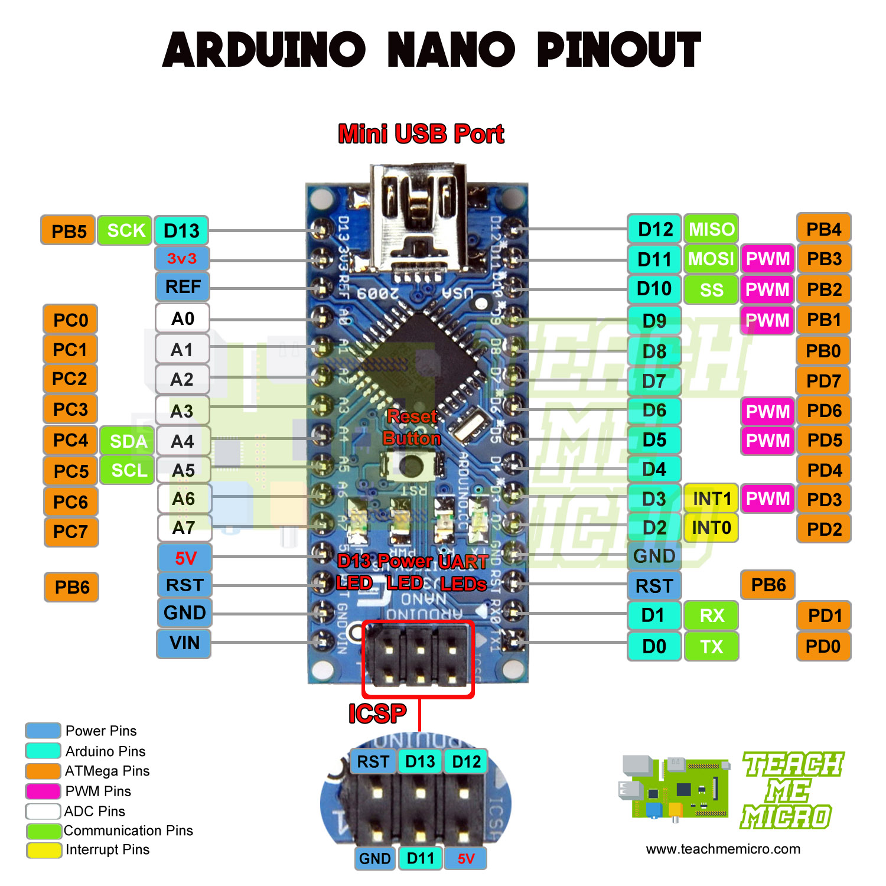

# TrafficLight
Made in 2 days using a Rasberry Pi 5 combined with Arduino Nano for managing a Smart Traffic light, both for cars and pedestrians
 
Time wasted: 14 hours
 
Neurons lost: I also lost the guys that were counting, so a lot.
 
 
<!-- Project replication -->
## How can you replicate my code?
You need the following: 
* Rasberry Pi (you can use whatever, I used RPI 5 (8GB)
* Arduino Nano
* Colored LEDs, resistors, wires (Search for a Plusivo Kit - or buy its contents piece by piece)

<!-- Programs used -->
## Programs used
* Thonny (Pyhon - already installed on my RPi)
* Arduino IDE

<!-- Connection tutorial -->
## What & where to connect - start (finish)
 <li>* Rasberry PI:  </li>
  Ground1 (1st board, for all LEDs/Buttons),, GPIO14 TXD (Arduino RX), GPIO15 RXD (Arduino TX), GPIO25 (Red LED CAR), GPIO8 (Yellow LED CAR), GPIO7 (Green LED CAR), GPIO21 (Start Button), GPIO2 (Red LED PED), GPIO3 (Green LED PED)
* Arduino Nano 
 D12 (Blue counter LED), D11 (White confirmation LED), D4 (Counter Button), D3 (Confirmation button), RX (RPi TX), TX (RPi RX), GND (2nd board, for Arduino/Buttons/LEDs) 

More information can be found in the code comments, you'll find the project configurations, etc.
